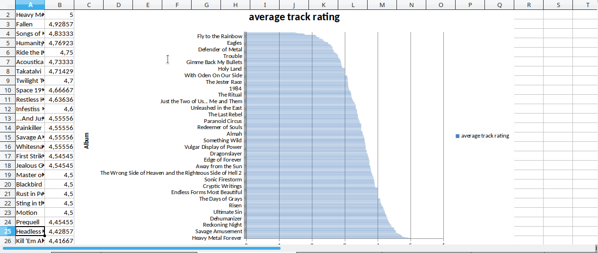

# Fantastic-Library-Rating-Backup-and-Analyzer
**[Português](#português)**  
**[English](#english)**  

## Português
**[FLRBA](https://github.com/1Deterministic/Fantastic-Library-Rating-Backup-and-Analyzer)** é uma ferramenta de linha de comando que realiza backups de avaliações de músicas .mp3, podendo restaurar essas informações de volta para os arquivos com suporte a nomes por aproximação e também gera tabelas e gráficos com as informações obtidas.

## Dependências
Para poder utilizar o programa você deve possuir o **[Python 3](https://www.python.org/downloads/)** instalado, junto das bibliotecas a seguir:

* eyed3
* xlsxwriter
* fuzzywuzzy (python-Levenshtein é recomendado mas não necessário)

Todas estão disponíveis via pip:

* `sudo pip3 install eyed3 xlsxwriter fuzzywuzzy python-Levenshtein`

## Utilização
Existem três opções possíveis para utilização do programa: realizar o backup, restaurar o backup e exportar as informações

* para realizar o backup, rode: `python3 flrba.py save_from /caminho/da/pasta`. Todos os arquivos `.mp3` dentro de `/caminho/da/pasta` e suas subpastas serão lidos e as informações guardadas no arquivo `database.db`, dentro da pasta do projeto.
* para restaurar o backup, rode: `python3 flrba.py restore_ratings_to /caminho/da/pasta`. Todos os arquivos `.mp3` dentro de `/caminho/da/pasta` e suas subpastas serão lidos e, se encontrados na base de dados `database.db`, terão o rating restaurado. 
* caso as tags sejam ligeiramente diferentes do backup, você pode usar o parâmetro `approximation` para aceitar tags por aproximação. Nesse caso, o comando fica `python3 flrba.py restore_ratings_to /caminho/da/pasta approximation`
* para exportar as informações para uma tabela Excel, rode: `python3 flrba.py export_excel`. O arquivo estará na pasta do projeto, com o nome `analytics.xlsx`. Você pode ver screenshots **[aqui](https://github.com/1Deterministic/Fantastic-Library-Rating-Backup-and-Analyzer/Screenshots)**

Dependendo de seu sistema operacional, o Python 3 pode estar associado ao comando `python`, nesse caso você terá que corrigir os comandos. Você pode verificar rodando o comando `python -V` (V maiúsculo)

## English
**[FLRBA](https://github.com/1Deterministic/Fantastic-Library-Rating-Backup-and-Analyzer)** is a command line interface tool to make backups of .mp3 star ratings from a music library, being able to restore these ratings back to the files, supporting matching tags by approximation and also generates spreadsheets and charts with the information obtained.

## Dependências
To use this program you must have **[Python 3](https://www.python.org/downloads/)** installed, with the librarys below:

* eyed3
* xlsxwriter
* fuzzywuzzy (python-Levenshtein is recommended but not required)

They are available via pip:

* `sudo pip3 install eyed3 xlsxwriter fuzzywuzzy python-Levenshtein`

## Utilização
There are three options to use this program: make a backup, restore the backup and export the information saved.

* to make a backup, run: `python3 flrba.py save_from /path/to/folder`. All `.mp3` in `/path/to/folder` and its subfolders will be read and the information stored in the file `database.db`, in the project folder.
* to restore the backup, run: `python3 flrba.py restore_ratings_to /path/to/folder`. All `.mp3` files in `/path/to/folder` and its subfolders will be read and, if present in the database `database.db`, will have their ratings restored
* if the tags are slightly different from the ones in the backup, you can use the parameter `approximation` to accept tags by approximation. In this case, the comand is: `python3 flrba.py restore_ratings_to /path/to/folder approximation`
* to export the database to a Excel spreadsheet, run: `python3 flrba.py export_excel`. The file will be in the project folder, with the name `analytics.xlsx`. You check for screenshots **[here](https://github.com/1Deterministic/Fantastic-Library-Rating-Backup-and-Analyzer/Screenshots)**

Depending on your OS, Python 3 can be associated with the command `python`. In this case, you have to change the commands to use it. You can check this by running `python -V` (uppercase V)

## [1Deterministic](https://github.com/1Deterministic), 2018